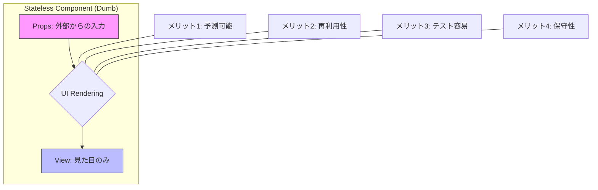

## ステートレスコンポーネントとは

基本的にはstateは親コンポーネントで定義して、子コンポーネントに渡すと良い。

```javascript
// ステートレスの例：propsを受け取って表示するだけ
const UserCard = ({ name, age }) => (
  <div>
    <h2>{name}</h2>
    <p>{age}歳</p>
  </div>
);
```

## 完全なステートレスではないが閉じたstateしか持っていないので、問題にならない例

```javascript
// 子コンポーネント：親に影響しないUIの状態は自分で持ってよい
const Accordion = ({ title, content }) => {
  const [isOpen, setIsOpen] = useState(false); // ← これはOK

  return (
    <div>
      <button onClick={() => setIsOpen(!isOpen)}>{title}</button>
      {isOpen && <p>{content}</p>}
    </div>
  );
};
```

## ステートフルな子コンポーネントを持っていために、崩壊する例

```javascript
// 子：商品の個数を管理
const ItemRow = forwardRef(({ name, price }, ref) => {
  const [quantity, setQuantity] = useState(0);

  useImperativeHandle(ref, () => ({
    getQuantity: () => quantity,
    getName: () => name,
    getPrice: () => price,
  }));

  return (
    <div>
      <span>{name} (¥{price})</span>
      <button onClick={() => setQuantity(q => q + 1)}>+</button>
      <span>{quantity}</span>
    </div>
  );
});

// 親：合計を計算するために子のstateを覗く
const OrderForm = () => {
  const itemRefs = [useRef(), useRef(), useRef()];
  const [total, setTotal] = useState(0);
  const items = [
    { name: 'コーヒー', price: 500 },
    { name: 'サンドイッチ', price: 800 },
    { name: 'ケーキ', price: 600 },
  ];

  const calculateTotal = () => {
    let sum = 0;
    itemRefs.forEach(ref => {
      sum += ref.current.getQuantity() * ref.current.getPrice();
    });
    setTotal(sum);
  };

  return (
    <div>
      {items.map((item, i) => (
        <ItemRow key={i} ref={itemRefs[i]} name={item.name} price={item.price} />
      ))}
      <button onClick={calculateTotal}>合計を計算</button>
      <p>合計: ¥{total}</p>
    </div>
  );
};
```

## メリット

